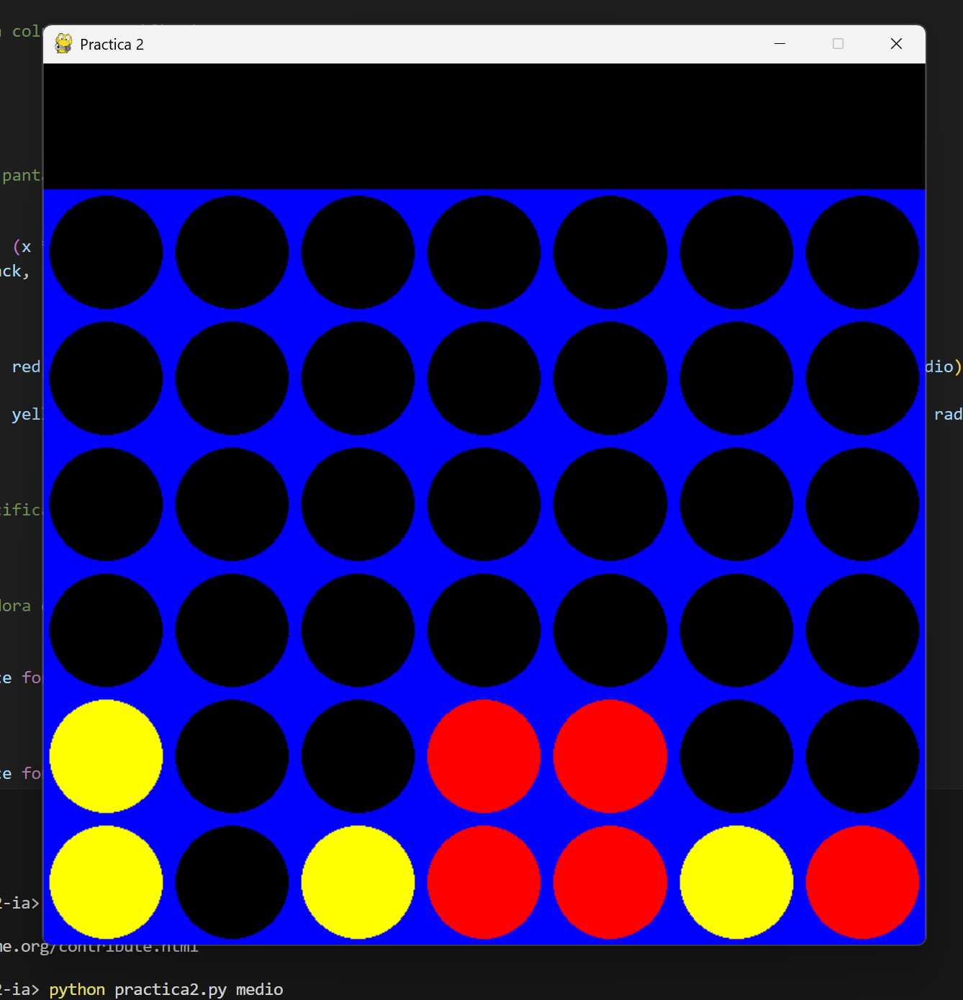

# 🎮 Connect 4 Game

This is a connect 4 game where you play against an AI cpu that uses mini-max

---

## Instalation

to install the necessary dependencies, run:

```bash
pip3 install pygame
pip3 install numpy
```

---

## Use

to execute the game, run the following command:

```bash
python connect4.py <difficulty>
```

where `<difficulty>` can be the any of this settings:

| Level   | Command  |
|---------|----------|
| Easy    |  `facil` |
| Medium  | `medio`  |
| Hard    | `dificil`|

example:

```bash
python connect4.py medio
```

---

## Características

- Implements the algorithm **MiniMax** for the cpu AI.  
- Supports different settings of difficulty.  
- Graphical interface using **pygame**.  

---

## Capturas de Pantalla



## Licencia

Este proyecto está bajo la licencia **MIT**. Puedes usarlo, modificarlo y compartirlo libremente.
